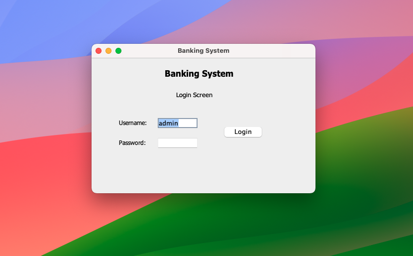

# 🏦 Banking System (Java Swing)

A simple **Java Swing application** that simulates basic banking operations.  
It provides a user-friendly GUI for managing accounts, deposits/withdrawals, and viewing transaction history.  

---

## ✨ Features
- 👤 **Account Management**  
  - Create Savings, Current, or Student accounts  
  - Unique account numbers auto-generated  

- 💰 **Transactions**  
  - Deposit and withdrawal  
  - Minimum balance enforcement  
  - Withdrawal limit check  

- 📊 **Balance & History**  
  - Check account balance  
  - Maintain transaction history  

- 🎨 **User-Friendly GUI** built using Java Swing  

---

## 🛠️ Technologies Used
- Java (JDK 8+)
- Java Swing (GUI)
- Java Serialization (to store data)

---

## 🚀 Installation & Setup

1. **Clone the repository**
   ```bash
   git clone https://github.com/your-username/banking-system.git
   cd banking-system
   ```

2. **Compile the project**
   ```bash
   javac -d bin src/Bank/*.java src/Data/*.java src/Exceptions/*.java src/GUI/*.java src/*.java
   ```

3. **Run the application**
   ```bash
   java -cp bin Application
   ```
   or  
   ```bash
   java -cp bin Run
   ```
   (depending on which contains the `main()` method)

---

## 🔑 Default Login
- **Username:** `admin`  
- **Password:** *(see `Login.java` for hardcoded password or check `data.bin`)*  

---

## 📸 Screenshots
| Login Screen | Dashboard |
|--------------|-----------|
|  |  |

---

## 📂 Project Structure
```
BankingSystem-master
├── src/                 # Source files
│   ├── Bank/            # Bank account & models
│   ├── Data/            # File I/O handling
│   ├── Exceptions/      # Custom exceptions
│   └── GUI/             # Swing UI components
├── bin/                 # Compiled class files
├── data/                # Serialized storage
├── screenshot/          # Demo screenshots
├── README.md
└── Bank.pdf             # Documentation
```

---

## 🤝 Contribution
Contributions are welcome! Feel free to fork this repo and submit pull requests.

---

## 📜 License
This project is licensed under the **MIT License**.  
You are free to use, modify, and distribute this project.
